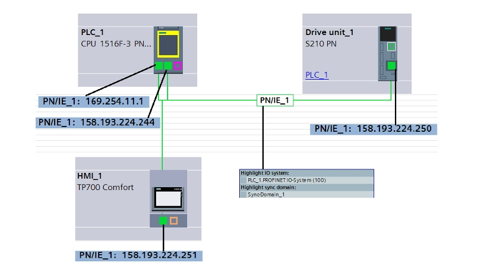
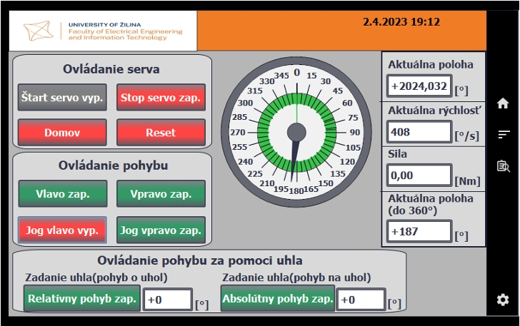
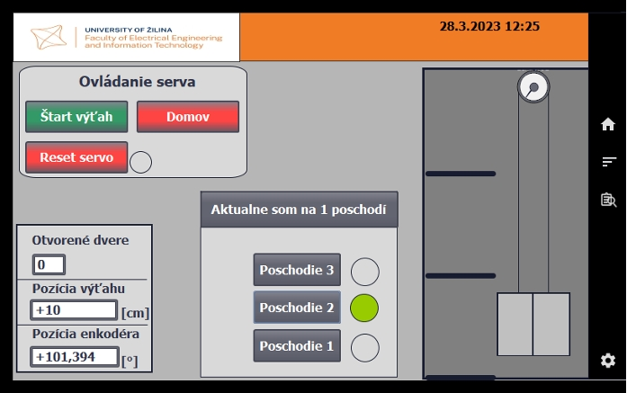
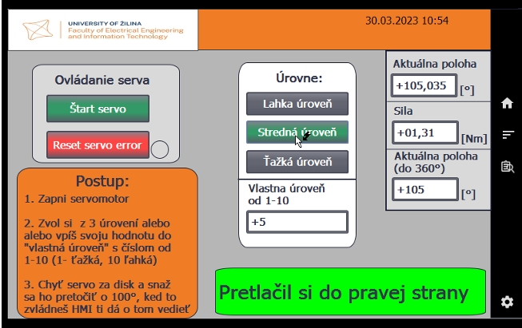

# SINAMICS S210 Servo Drive Control – Educational Examples

This repository contains the software implementation of educational examples focused on the configuration and control of the **SINAMICS S210** servo drive using the **SIMATIC S7-1500** PLC series. This project was developed as the practical part of a Bachelor's thesis at the **University of Žilina**.

---

### 🌐 Language Note
> [!NOTE]
> The screenshots provided in this documentation are in **Slovak**, but every TIA Portal project is configured to be multilingual and can be **switched to English**. The full text of the Bachelor's thesis is available in Slovak.

---

## 🛠 Hardware and Software
The following components were used for the development and are required for the full functionality of the project:

* **PLC:** Siemens SIMATIC S7-1516F-3 PN/DP
* **Servo Drive:** SINAMICS S210
* **Motor:** SIMOTICS S-1FK2 with integrated encoder
* **HMI:** Siemens TP700 Comfort (for visualization)
* **Software:** TIA Portal V16

### 🔌 System Connection
The image below illustrates the wiring and communication setup between the HMI, PLC, and the SINAMICS S210 drive.

---

## 📚 Project Content
The project is divided into three main educational examples demonstrating various aspects of **Motion Control**:

1.  **Basic Drive Functions:** Demonstration of basic movements, position settings within $360^{\circ}$, force/torque control, and HMI interfacing.
2.  **Elevator Model:** A practical application simulating elevator control, ensuring precise movement between floors.
3.  **"Pushing" Application:** An example focused on torque limiting and the use of technology blocks for force control.

---

## 📂 Detailed Description of Examples

### 1. Basic Servo Drive Functions
This example serves as an introduction to controlling the drive via PLC. It includes the core logic for axis activation and simple motion commands.

* **Functionality:** Axis enable (`MC_Power`), error reset (`MC_Reset`), homing (`MC_Home`), manual movement (Jog), and positioning to specific coordinates.
* **HMI Visualization:** Includes axis status indicators (Error, Done, Velocity reached) and control buttons.

**HMI Screenshot – Basic Functions:**

---

### 2. Elevator Model (Sequential Control)
This example simulates the control of an elevator in a three-story building, demonstrating logical conditions and sequential execution of motion commands.

* **Control Logic:** The elevator moves between floors (absolute positions) based on button inputs. The program monitors the direction of travel and the current cabin position.
* **Practical Use:** Demonstrates absolute positioning (`MC_MoveAbsolute`) and conditional jumps within the program.
* **Safety:** Simulation of software limit switches to safely stop the cabin.

**PLC Logic Screenshot – Elevator Control:**

---

### 3. "Pushing" Application (Torque Limiting)
A more advanced example focusing on motor torque control, essential for applications involving physical contact with objects.

* **Principle:** The drive moves toward an obstacle. Once the set torque (force) limit is reached, the drive stops increasing power and indicates the "pushing" state.
* **Key Block:** `MC_TorqueLimiting`, which allows dynamic changes to torque limits during operation.
* **Applications:** Pressing, tightening, or protecting mechanical parts from damage.

**HMI Screenshot – Torque Limit Settings:**

---

## ⚙️ Motion Control Blocks Used
The program utilizes standard **PLC Open** blocks for interacting with Technology Objects (TO):

* `MC_POWER` – Enable/Disable axis.
* `MC_RESET` – Acknowledge errors.
* `MC_HOME` – Set reference point.
* `MC_MOVEABSOLUTE` / `MC_MOVERELATIVE` – Absolute and relative positioning.
* `MC_MOVEJOG` – Manual movement.
* `MC_TORQUELIMITING` – Torque limitation (primarily used in Example 3).

---

## 🚀 How to Run the Project
1.  Download the project archive (`.zap16` file) or copy the project folder.
2.  Open **TIA Portal V16**.
3.  Use the `Project > Retrieve` function and select the archive file.
4.  Verify the HW configuration and IP addresses (pre-configured according to the laboratory setup).
5.  Compile and download the configuration and program to the PLC and HMI panel.

---

## 📝 Author & Thesis
* **Author:** Tomáš Novotný
* **Supervisor:** doc. Ing. Juraj Ždánsky, PhD.
* **Institution:** University of Žilina, Faculty of Electrical Engineering and Information Technology
* **Year:** 2023

For more detailed information, please refer to the full Bachelor's thesis (written in Slovak):
📄 **[Download Thesis (PDF)](img/thesis.pdf)**
